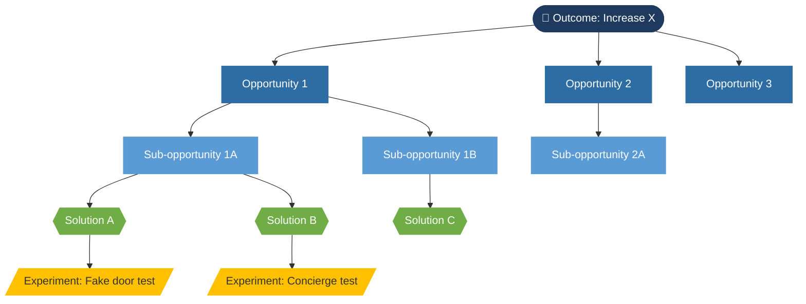
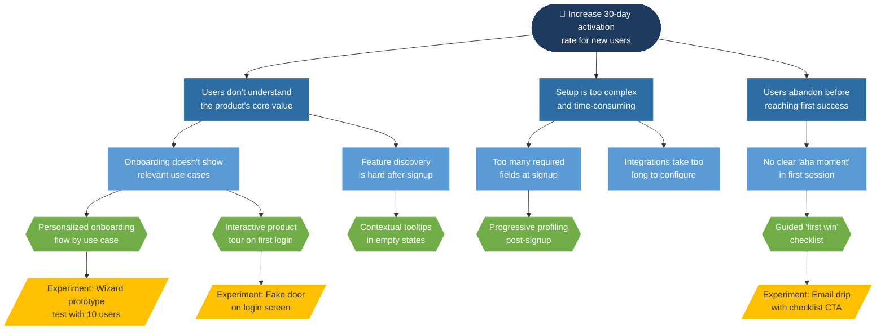

# Opportunity Solution Tree Skill

## Purpose
Build a structured Opportunity Solution Tree (OST) that connects a product outcome to the customer opportunities that support it, the potential solutions for each opportunity, and the experiments that can validate those solutions — following Teresa Torres' Continuous Discovery Habits framework.

---

## Background: OST Framework

The OST has four layers:

```
OUTCOME
  └── Opportunity 1
        ├── Opportunity 1a (sub-opportunity)
        └── Opportunity 1b (sub-opportunity)
              ├── Solution A
              │     └── Experiment → Test assumption
              └── Solution B
                    └── Experiment → Test assumption
  └── Opportunity 2
        └── ...
```

**Key principles to embed in the output:**
- The outcome is a **business metric with a direction** (not a feature or project)
- Opportunities are **customer needs, pain points, or desires** — discovered through research, not invented
- Solutions are **product ideas** that address a specific opportunity (one solution per opportunity branch)
- Experiments test the **riskiest assumption** behind a solution

---

## Step 1: Gather Context

Ask in a single batch if not provided:

- **What is the product or product area?** (helps ground the tree)
- **What is the desired outcome?** (the metric or behavior you want to shift — ideally already defined)
- **What customer research exists?** (interview notes, survey data, support tickets, usage data)
- **Who is the primary customer?** (persona or segment)
- **What solutions are already being considered?** (capture existing thinking, then map it to the tree)
- **How mature is this work?** (early discovery vs. refining an existing tree vs. preparing for a review)
- **What format is needed?** (text/Markdown for docs, or a visual structure described in Markdown?)

---

## Step 2: Define the Outcome

The outcome is the root of the tree. It must be:
- A **metric** (not a project, feature, or initiative)
- **Directional** (increase, decrease, maintain)
- **Owned by the team** (within their control or influence)
- **Connected to a business goal** (not purely an activity)

**Good outcomes:**
- "Increase 30-day activation rate for new users"
- "Reduce churn among mid-market accounts"
- "Increase weekly active usage of the reporting module"

**Bad outcomes (reframe these):**
- "Launch mobile app" → What metric does this move?
- "Improve UX" → Improve it how, for whom, measured how?
- "Customer satisfaction" → Too vague; which segment, which touchpoint?

If the user provides a vague outcome, help them sharpen it before building the tree.

---

## Step 3: Map the Opportunity Space

Opportunities are discovered from customers — not invented by the team.

### Opportunity Guidelines:
- Express as **customer needs, pain points, or desires** — not company goals
- Use the customer's voice where possible ("I can't find my data when I need it" not "Data discoverability")
- Avoid solution language ("Users need a better search" → "Users struggle to find past records quickly")
- Map at **two levels of depth minimum**: broad opportunities → sub-opportunities

### Opportunity Sourcing Prompts (use these to help user generate opportunities):
- "What do customers complain about in support tickets or NPS feedback?"
- "What jobs are customers trying to do with your product?"
- "Where do users drop off or struggle in the flow?"
- "What workarounds have you observed customers using?"
- "What do churned customers say was missing?"

### Opportunity Sizing (optional but valuable):
For each opportunity, note:
- **Frequency:** How often does this come up?
- **Severity:** How much does it impact the customer?
- **Reach:** How many customers experience it?

---

## Step 4: Map the Solution Space

For each opportunity (especially the target opportunity), generate 2-4 potential solutions.

### Solution Guidelines:
- Solutions should directly address the opportunity they're attached to
- Generate **multiple** solutions per opportunity — avoid anchoring on the first idea
- Solutions can be product features, UX changes, new flows, integrations, or policy changes
- Solutions should vary in scope and approach (don't just list variations of the same idea)

### Solution Prompts:
- "What's the simplest thing we could ship that would help with this?"
- "What would the ideal experience look like if we had unlimited time?"
- "What have competitors done here?"
- "What could we do with existing infrastructure vs. new investment?"

---

## Step 5: Define Experiments

For each prioritized solution, identify the **riskiest assumption** and design a small experiment to test it.

### Experiment Structure:

```
Solution: [Name]
Riskiest Assumption: [What must be true for this solution to work?]
Experiment: [How will we test that assumption?]
Signal: [What will we observe that tells us we're right or wrong?]
Timeline: [How long / how many users?]
```

### Experiment Types (from lightest to heaviest):
- **Assumption mapping:** List and rank assumptions by risk
- **Fake door / smoke test:** Offer the feature before building it; measure click-through
- **Concierge:** Manually do the thing the product would automate
- **Prototype test:** Clickable prototype with real users
- **A/B test:** Live traffic split on real implementation
- **Staged rollout:** Limited release to a cohort

---

## Step 6: OST Output Format

Produce the tree as a structured Markdown document:

---

### Opportunity Solution Tree

**Product Area:** [Name]  
**Author:** [Name]  
**Date:** [Date]

---

#### 🎯 Outcome
> [Metric] — [Direction and target]  
> *Connected to: [Business goal or OKR]*

---

#### 🔍 Opportunity Space

**Opportunity 1: [Name]**  
*Customer voice: "[Quote or paraphrase from research]"*  
- Frequency: High / Medium / Low  
- Severity: High / Medium / Low  
- Evidence: [Source]

> **Sub-opportunity 1a:** [Name]  
> **Sub-opportunity 1b:** [Name]

---

**Opportunity 2: [Name]**  
*(Repeat structure)*

---

#### 💡 Solution Space

*Target opportunity: [Which opportunity are we solving for first and why?]*

**Solution A: [Name]**
- Description: [What it does]
- Addresses: [Sub-opportunity 1a]
- Size/complexity: Small / Medium / Large

**Solution B: [Name]**  
*(Repeat)*

---

#### 🧪 Experiment Layer

**Solution A — Experiment:**
- Riskiest assumption: [X]
- Experiment: [Y]
- Signal: [Z]
- Timeline: [T]

---

#### 📌 Open Questions & Next Steps

- Which opportunity should we target first? (decision needed)
- What additional research is needed to validate the opportunity space?
- Who should review this tree? (PM, Design, Eng, leadership)

---

## Step 7: Mermaid Diagram

After producing the Markdown OST document, always generate a Mermaid diagram so the tree can be rendered visually. This is especially useful for team reviews, Notion pages, or stakeholder presentations.

---

### Diagram Guidelines

- Use `graph TD` (top-down) layout — this matches the natural OST hierarchy
- Use **node shapes** to distinguish each layer visually:
  - **Outcome:** Stadium shape `([Outcome])` — rounded rectangle
  - **Opportunity:** Rectangle `[Opportunity]`
  - **Sub-opportunity:** Rectangle `[Sub-opportunity]`
  - **Solution:** Hexagon `{{Solution}}` — or use `[/Solution\]` trapezoid for distinction
  - **Experiment:** Parallelogram `[/Experiment/]`
- Use **`classDef`** to apply color coding by layer
- Keep node labels short (4-7 words max) — use IDs to avoid duplicate label collisions
- Use `-->` for standard connections; add `-- "label" -->` for edge labels if the relationship needs clarification

---

### Color Scheme (classDef)

```
classDef outcome fill:#1e3a5f,color:#fff,stroke:#1e3a5f
classDef opportunity fill:#2e6da4,color:#fff,stroke:#2e6da4
classDef subopportunity fill:#5b9bd5,color:#fff,stroke:#5b9bd5
classDef solution fill:#70ad47,color:#fff,stroke:#70ad47
classDef experiment fill:#ffc000,color:#333,stroke:#ffc000
```

---

### Mermaid Template



---

### Worked Example (Activation Rate OST)



---

### Diagram Scoping Notes

- If the tree is large (5+ opportunities, many solutions), **scope the diagram to the target opportunity branch** only — full trees become unreadable at scale
- In that case, add a note: `%% Full tree scoped to priority branch: [Opportunity Name]`
- Offer to generate a full tree vs. a focused branch view when the content warrants it
- For experiments, only include them for solutions that have been prioritized — not every solution needs an experiment node in the diagram

---

## Step 8: Facilitation Notes

If the user is building this for a team workshop or review, offer these additions:
- **Pre-read framing:** A paragraph explaining the OST to non-PM stakeholders
- **Workshop agenda:** How to run an OST review session (30-60 min)
- **Common pitfalls to flag:** Solution-first thinking, outcome = project, skipping the opportunity layer

---

## Output Format

- Produce the OST as structured Markdown (tree format using headers and indentation)
- Include the outcome, 3-5 opportunities with sub-opportunities, 2-4 solutions for the priority opportunity, and at least 1 experiment
- **Always include a Mermaid diagram** after the Markdown document — default to the priority branch view if the tree is large
- Flag where the user needs to add research evidence vs. where Claude has generated hypothetical content
- Offer to expand any branch, generate a full-tree diagram, or produce a focused single-opportunity diagram on request
